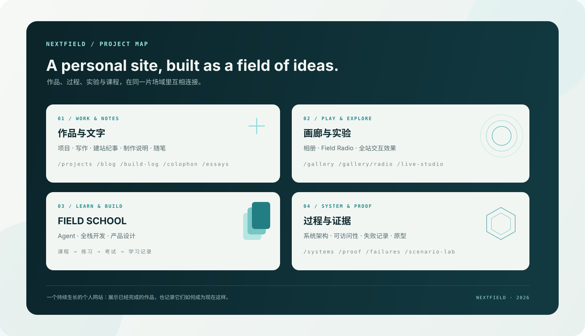

# NEXTFIELD / 下一场域

NEXTFIELD（下一场域）是一个以个人作品集为入口、持续生长的创作与学习网站。它把项目、文章、开发记录、日常随笔、摄影画廊、音乐电台、交互实验室和 Agent/全栈课程放在同一套视觉系统中；既展示做成的东西，也记录它们如何被构思、实现、测试和修正。

项目页重点介绍 [Neptune 多 Agent 工作空间](https://github.com/Cattleyaaaaa/Neptune-Multi-agent-Workspace)，并提供[项目网站](https://myneptune.tech/)和源码入口。站点围绕“可探索的作品集、可持续写作、可交互实验、可学习的技术内容”组织，而不是单一的个人简介页。



这张图是项目内容地图（不是网页截图），概括了网站的四个内容区域和对应路由。README 中的图片均使用仓库内相对路径，随代码一起显示，不依赖外部图床。

### 网页预览

以下为本地生产构建的实际页面截图，展示项目介绍、学习首页、电台和建站纪事。截图以 JPG 压缩并保存在 `docs/images/`，方便直接在 GitHub README 中浏览。

| 项目 | 学习 |
|:---:|:---:|
|  |  |

| Field Radio | 建站纪事 |
|:---:|:---:|
|  |  |

主要内容包括：

- 个人首页、关于页、项目索引和作品详情。
- 写作文章、建站纪事、制作说明与随笔；正文以 MDX 文件维护，点击索引卡片可阅读完整文章。
- 画廊：将 `public/gallery/` 中的文件夹作为相册分类，支持相册索引与相册详情。
- Field Radio：按歌手检索、播放控制、唱片封面和同步歌词。站内歌曲、歌词及封面已确认获得公开传播授权；若将来替换内容，仍需逐项确认权利与署名要求。
- 开放实验室：全站动效开关、滑动水波、点击反馈等可交互效果。
- FIELD SCHOOL：Agent、全栈开发、产品设计 3 条学习路径，双语课程、案例与资源、代码练习、学习进度和结课考试。课程阅读不需要登录；GitHub 登录、跨设备进度、服务端考试记录依赖 Supabase。AI 导师需额外配置模型服务。
- Systems、Evidence、Failures 等页面，用于展示架构、交互原型、可访问性与项目过程。

站点中文/英文界面共享同一套页面与内容模型。界面文案集中在翻译模块中；文章正文可分别编写双语内容。部分品牌名、技术专有名词及视觉标签会刻意保留英文。

## 本地运行

当前项目使用 Next.js 15、React 18、TypeScript、Tailwind CSS、GSAP、Framer Motion 和 Three.js。Cloudflare 部署使用 OpenNext 与 Wrangler；内容以 MDX、TypeScript 数据模块及 `public/` 静态资源维护。请使用 Node.js 20 LTS 或更新版本，并使用 npm。

```bash
npm install
npm run dev -- -p 3333
```

打开 <http://localhost:3333>。基础页面无需环境变量；若要测试 GitHub 登录、账户进度和模型功能，先参考 [.env.example](.env.example) 配置本地 `.env.local`。不要把密钥写进源码或提交到仓库。

## 项目结构与代码分层

```text
app/                 Next.js App Router 页面、布局和服务端 API
components/          页面组件，按站点、首页、学习、画廊、视觉等功能分组
  site/              全站导航、语言/主题、页面框架和转场
  home/              首页与首页分屏
  learn/             FIELD SCHOOL 学习、练习、考试与账户界面
  editorial/         文章目录与文章阅读视图
  visual/            视觉效果、粒子/交互组件及其局部模型与样式资源
  gallery/           画廊与电台组件
  projects/          项目索引与项目卡片
  evidence/          Systems/Evidence 页面中的演示模块
  motion/            通用动效与动效辅助组件
  react-bits/        基于 React Bits 整理的独立 UI 效果
lib/                 页面共享的数据、类型辅助、认证/考试服务和浏览器状态逻辑
content/posts/       MDX 写作文章
public/              可由访客直接访问的图片、音频、字体、下载文件与公开 JSON
  gallery/<相册>/    按目录组织的画廊图片
  audio/ covers/ lyrics/  电台音频、封面与 LRC 歌词
supabase/migrations/ 学习系统数据库迁移
scripts/             内容校验和资源生成/维护脚本
types/               跨模块共享的 TypeScript 类型
docs/                部署与运维说明
```

页面路由由 `app/` 管理，组件只负责视图和交互；可复用的数据与业务逻辑放在 `lib/`，而文章、相册和静态文件分别放在 `content/` 与 `public/`。新增功能时优先沿用这个边界：不要把长篇数据直接塞进页面组件，也不要在组件中硬编码密钥或服务端凭证。组件按功能归档，视觉效果及其专属静态资源统一放在 `components/visual/`。

重要的根配置文件：

- 应用依赖与命令：`package.json`、`package-lock.json`。
- Next.js 与 TypeScript：`next.config.mjs`、`tsconfig.json`、`next-env.d.ts`、`mdx-components.tsx`。
- 样式与组件工具：`tailwind.config.ts`、`postcss.config.mjs`、`components.json`、`.eslintrc.json`。
- Cloudflare：`open-next.config.ts`、`wrangler.jsonc`。
- 站点和环境模板：`site.config.ts`、`.env.example`。
- 仓库说明与版本控制：`README.md`、`.gitignore`。

这些文件之所以留在根目录，是因为 Next.js、npm、TypeScript、Tailwind、Wrangler 等工具默认从这里读取约定文件；把它们随意移动会导致工具找不到配置。`tsconfig.tsbuildinfo` 是 TypeScript 自动生成的增量检查缓存，现在写入隐藏的 `.cache/typescript/`，不会再混在源码和配置文件之间。

`.next*`、`.open-next/`、`.wrangler/`、`.cache/`、`node_modules/` 等目录是工具自动生成的缓存或构建产物，不是源代码，不应手工编辑或提交。旧的 `out/` 静态导出目录也不用于当前 Cloudflare 部署；Workers 构建从源码生成自己的部署包。

常用检查：

```bash
npm run typecheck
npm run lint
npm run build
node scripts/test-learning-content.cjs
node scripts/test-school.cjs
node scripts/test-school-auth.cjs
node scripts/test-school-exam.cjs
```

## 内容放在哪里

| 内容 | 编辑位置 |
| --- | --- |
| 站点名称、描述、正式域名及 GitHub 联系方式 | `site.config.ts` |
| 项目页的 Neptune 重点介绍与其他方向 | `components/projects/` |
| 写作文章 | `content/posts/*.mdx` |
| 画廊相册 | `public/gallery/<相册名>/`；规则见 [画廊说明](public/gallery/README.md) |
| 电台曲目、音频、封面与同步歌词 | `lib/radio-data.ts`、`public/audio/`、`public/covers/`、`public/lyrics/` |
| 学习课程、案例与考试 | `lib/learn-data.ts`、`lib/learn-guides.ts`、`lib/learning-resources.ts`、`lib/school-exam-data.ts` |
| 学习数据库结构 | `supabase/migrations/` |

`public/` 下的文件会被网站直接公开访问；放入画廊的图片、音频及歌词前，请检查个人信息、图片元数据和公开使用权限。电台曲目、歌词和唱片封面均已确认获得公开传播授权。

## 部署与运行方式

此站点包含服务端 API、GitHub 登录回调和考试判分，Cloudflare 部署目标为 Workers，**不能使用纯静态导出，也不能直接上传 `out/` 到 Cloudflare Pages**。正式域名为 `https://nextfield.top`，已写入 `site.config.ts` 和 Wrangler 自定义域名配置。部署前运行 `npm run typecheck`、`npm run lint` 和 `npm run preview`，并在真实 Workers 预览环境复核核心路由与音频播放。

### 环境变量与登录

按 [.env.example](.env.example) 配置部署环境；本地密钥写入被 Git 忽略的 `.env.local`。以下变量在 Vercel 或 Cloudflare 的生产环境中都需要按功能设置：

| 变量 | 用途 | 公开性 |
| --- | --- | --- |
| `NEXT_PUBLIC_SUPABASE_URL`、`NEXT_PUBLIC_SUPABASE_ANON_KEY` | Supabase 项目和客户端登录 | 可公开；构建时也需可用 |
| `SUPABASE_SERVICE_ROLE_KEY` | 服务端考试、记录与额度操作 | 仅服务端 Secret |
| `SITE_URL` | 正式站点 origin，如 `https://你的域名` | 服务端配置；不要带路径或末尾斜杠 |
| `OPENAI_API_KEY`、`OPENAI_MODEL` | 可选课程导师 | API Key 仅服务端 Secret |
| `FIELD_AI_ENABLED` | 模型功能开关，默认 `false` | 启用前先设置费用与滥用防护 |

在 Supabase 依次应用 `supabase/migrations/` 中尚未执行的迁移，并完成 [FIELD SCHOOL 部署说明](docs/field-school-deployment.md)中的 GitHub OAuth 和权限配置。GitHub OAuth App 的 Authorization callback URL 填 Supabase 提供的 `https://<project-ref>.supabase.co/auth/v1/callback`；Supabase 的 Redirect URLs 则加入 `https://你的域名/auth/callback`。绑定域名后同时更新 `site.config.ts` 的 `url`、`SITE_URL` 和 Supabase Site URL，然后重新部署。不要把 `SUPABASE_SERVICE_ROLE_KEY` 或 `OPENAI_API_KEY` 加上 `NEXT_PUBLIC_` 前缀。

### Cloudflare Workers

项目已配置 [OpenNext Cloudflare 适配器](https://opennext.js.org/cloudflare/get-started)和 Wrangler：Next.js 15 构建通过，Workers 本地预览已验证首页、文章、课程、相册及学习 API。OpenNext 在 Windows 上仍提示运行时可能不稳定；本地预览可用，持续部署建议使用 Linux CI 或 WSL。Cloudflare 对新 Next.js 项目默认推荐 beta 阶段的 vinext；这里选择 OpenNext 是为了保留当前 Next.js 项目结构。

1. 安装依赖后运行 `npm run typecheck` 和 `npm run preview`。预览脚本会构建 OpenNext 应用并在本机 Workers 运行时启动；`npm run cloudflare:build` 只生成构建产物，不发布。
2. 使用 Wrangler 登录：`npx cross-env XDG_CONFIG_HOME=.wrangler wrangler login`。本地授权状态保存在已被 `.gitignore` 忽略的 `.wrangler/` 目录。
3. 在 Cloudflare 的 **Variables and Secrets** 中配置环境变量。`NEXT_PUBLIC_SUPABASE_URL` 和 `NEXT_PUBLIC_SUPABASE_ANON_KEY` 需在构建时可用；`SUPABASE_SERVICE_ROLE_KEY`、`OPENAI_API_KEY` 只能作为 Secret。也可用 `npx cross-env XDG_CONFIG_HOME=.wrangler wrangler secret put SECRET_NAME` 写入 Secret。本地 Workers 变量放在被忽略的 `.dev.vars` 文件。[变量说明](https://developers.cloudflare.com/workers/configuration/environment-variables/)。
4. 设置 Supabase 数据库迁移和 GitHub OAuth，回调配置见 [FIELD SCHOOL 部署说明](docs/field-school-deployment.md)。尚未配置 Supabase 时，学习页面可以浏览，但登录、进度同步、正式考试和公开档案不可用。
5. 确认 `nextfield.top` 是已激活的 Cloudflare Zone，且没有冲突的 CNAME，然后运行 `npm run deploy`。Wrangler 会把该 Worker 绑定到 `nextfield.top` 并创建所需 DNS/证书配置；[Cloudflare Custom Domains 说明](https://developers.cloudflare.com/workers/configuration/routing/custom-domains/)。

### Vercel（当前 Next.js 构建可用）

把网站仓库导入 Vercel，选择 Next.js，构建命令保持 `npm run build`；不要设置静态导出。填入上述环境变量，先用预览地址检查公开页面，再配置正式域名与 Supabase/GitHub 回调。登录、考试及权限的逐项验收见 [FIELD SCHOOL 部署说明](docs/field-school-deployment.md)。

无论使用哪家平台，正式开放前都要用两个不同账户验证登录、退出、进度隔离、考试资格与公开档案权限，并检查中英文、移动端、断网及音频播放。Cloudflare 构建成功只代表代码可打包；不代表 Cloudflare 账号、Supabase、GitHub OAuth 或线上功能已经配置和验收。

## 仓库与隐私

`.gitignore` 忽略本地环境变量、Cloudflare `.dev.vars`、私钥/证书、本地数据库、备份、测试报告和临时目录。忽略规则**不会移除已经提交过的文件，也不能撤销泄露的密钥**；若误提交了密钥，应立即在对应服务轮换并检查 Git 历史。可用 `git status --short --untracked-files=all` 检查待提交内容。
