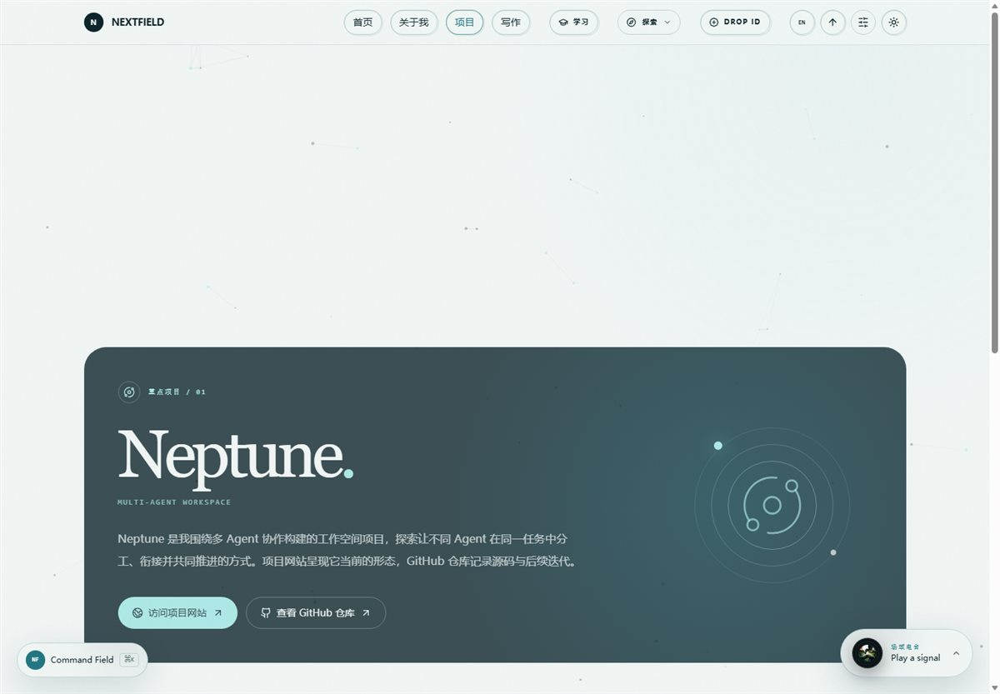
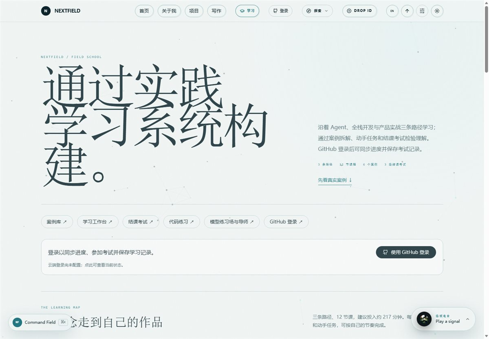
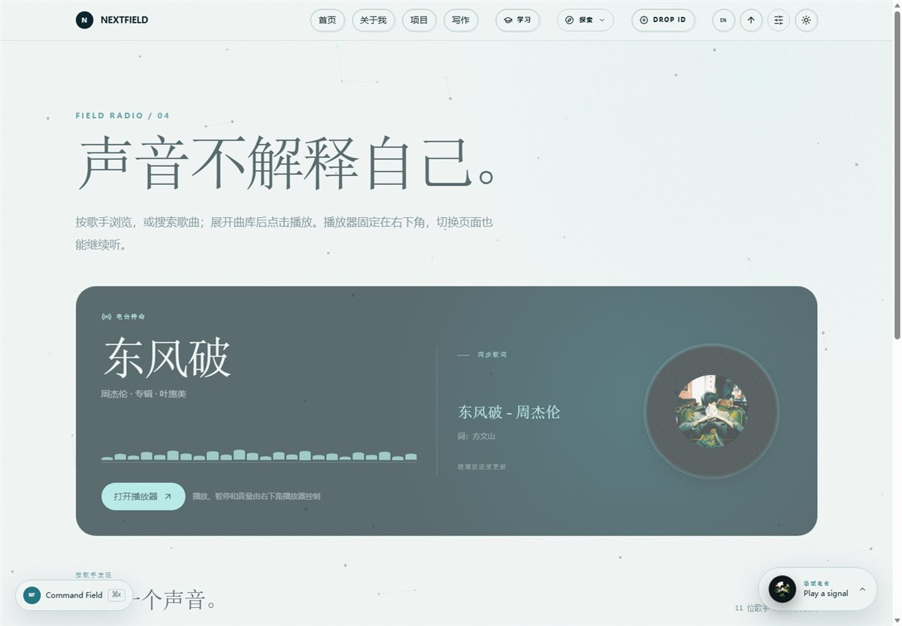
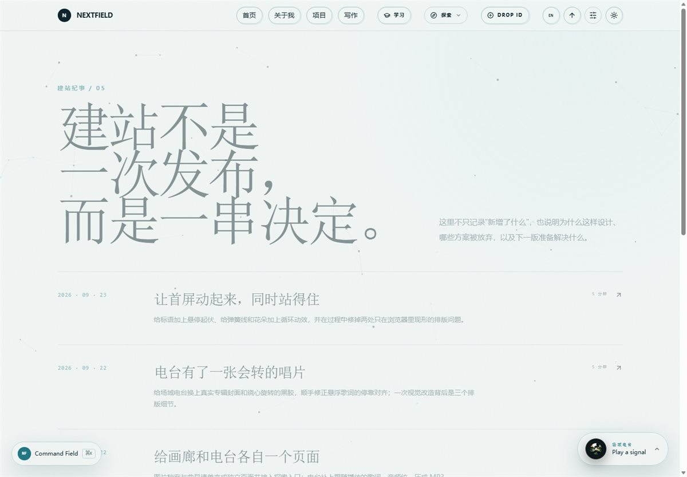

# NEXTFIELD / 下一场域

一个持续生长的个人网站，收录项目、写作、视觉实验与学习内容。项目页以 [Neptune 多 Agent 工作空间](https://github.com/Cattleyaaaaa/Neptune-Multi-agent-Workspace)为重点作品，提供[项目网站](http://myneptune.tech/)和源码入口；其他项目方向仍在整理中。

站内还有开放实验室、按文件夹生成相册的画廊、Field Radio，以及 FIELD SCHOOL：3 条学习路径、32 节双语课程、四阶段课程目录、案例库、代码练习、免登录综合自测和正式结课考试。Agent 路径从概念与 LLM 开始，逐步进入工具、状态、RAG、多 Agent 与生产实践；全栈路径从 Web 原理、HTML、CSS、JavaScript 开始，进入 React、接口、数据库、GitHub 登录、测试和交付。课程可直接阅读；GitHub 登录、跨设备进度、账户记录及正式考试依赖 Supabase。课程导师另需模型接口配置。

**V1.1.0** 重构了学习区，提供从入门到交付的课程路径。功能与验收清单见 [V1.1.0 说明](docs/v1.1.0-review.md)，版本更新见 [发布说明](docs/releases/V1.1.0.md)。正式考试每条路径 6 题，答对至少 5 题通过；开放自测每节课一道题，仅供复习，不上传成绩或生成正式记录。实践任务为学习者自查，不提供自动代码评分。

网站入口:https://nextfield.top/

## Analytics（V1.2.0）

本地新增 `/analytics` 公开统计看板，并在顶栏提供主要入口。包含 7/14/30/365 天筛选、请求数、周期独立访问、页面浏览、缓存命中率、传输带宽、小时与每日趋势、数据表和 JSON 导出。使用 Cloudflare Zone GraphQL 汇总数据，令牌仅存放服务端；不新增访客追踪脚本。未配置或查询失败会明确展示状态，不伪造实际流量；主动选择示例模式可审核布局和交互。

配置和指标口径见 [Analytics 说明](docs/analytics-deployment.md)。真实数据需要在部署环境配置具备 Zone Analytics 读取权限的 Cloudflare API Token；本仓库不包含令牌。

版本更新记录见 [CHANGELOG.md](CHANGELOG.md)。

## 页面预览

下方是网站的实际页面截图。点击图片可以查看大图。

| 项目展示 | 学习系统 |
| :---: | :---: |
| [](docs/images/projects.jpg) | [](docs/images/learn.jpg) |

| 音乐电台 | 建站纪事 |
| :---: | :---: |
| [](docs/images/gallery-radio.jpg) | [](docs/images/build-log.jpg) |

## 本地运行

当前项目使用 Next.js 14、React 18、TypeScript、Tailwind CSS、GSAP 和 Framer Motion。请使用 Node.js 18.17 或更新版本。

```bash
npm install
npm run dev -- -p 3333
```

打开 <http://localhost:3333>。基础页面无需环境变量；若要测试 GitHub 登录、账户进度和模型功能，先参考 [.env.example](.env.example) 配置本地 `.env.local`。不要把密钥写进源码或提交到仓库。

常用检查：

```bash
npm run typecheck
npm run lint
npm run build
node scripts/test-learning-content.cjs
node scripts/test-school.cjs
node scripts/test-school-auth.cjs
node scripts/test-school-exam.cjs
```

## 内容放在哪里

| 内容 | 编辑位置 |
| --- | --- |
| 站点名称、描述、正式域名及 GitHub 联系方式 | `site.config.ts` |
| 项目页的 Neptune 重点介绍与其他方向 | `components/projects/` |
| 写作文章 | `content/posts/*.mdx` |
| 画廊相册 | `public/gallery/<相册名>/`；规则见 [画廊说明](public/gallery/README.md) |
| 电台曲目、音频、封面与同步歌词 | `lib/radio-data.ts`、`public/audio/`、`public/covers/`、`public/lyrics/` |
| 学习课程、案例与考试 | `lib/learn-data.ts`、`lib/learn-guides.ts`、`lib/learning-resources.ts`、`lib/school-exam-data.ts` |
| 学习数据库结构 | `supabase/migrations/` |

## 部署

此站点包含服务端 API、GitHub 登录回调和考试判分，**不能使用纯静态导出，也不能直接上传 `out/` 到 Cloudflare Pages**。先在本地运行上面的检查，并确认准备发布的代码和 `public/` 资源都已进入网站仓库。`site.config.ts` 的 `url` 目前仍是 `https://example.com`，上线前必须改成正式域名。

### 环境变量与登录

按 [.env.example](.env.example) 配置部署环境；本地密钥写入被 Git 忽略的 `.env.local`。以下变量在 Vercel 或 Cloudflare 的生产环境中都需要按功能设置：

| 变量 | 用途 | 公开性 |
| --- | --- | --- |
| `NEXT_PUBLIC_SUPABASE_URL`、`NEXT_PUBLIC_SUPABASE_ANON_KEY` | Supabase 项目和客户端登录 | 可公开；构建时也需可用 |
| `SUPABASE_SERVICE_ROLE_KEY` | 服务端考试、记录与额度操作 | 仅服务端 Secret |
| `SITE_URL` | 正式站点 origin，如 `https://你的域名` | 服务端配置；不要带路径或末尾斜杠 |
| `OPENAI_API_KEY`、`OPENAI_MODEL` | 可选课程导师 | API Key 仅服务端 Secret |
| `FIELD_AI_ENABLED` | 模型功能开关，默认 `false` | 启用前先设置费用与滥用防护 |

在 Supabase 依次应用 `supabase/migrations/` 中尚未执行的迁移，并完成 [FIELD SCHOOL 部署说明](docs/field-school-deployment.md)中的 GitHub OAuth 和权限配置。GitHub OAuth App 的 Authorization callback URL 填 Supabase 提供的 `https://<project-ref>.supabase.co/auth/v1/callback`；Supabase 的 Redirect URLs 则加入 `https://你的域名/auth/callback`。绑定域名后同时更新 `site.config.ts` 的 `url`、`SITE_URL` 和 Supabase Site URL，然后重新部署。不要把 `SUPABASE_SERVICE_ROLE_KEY` 或 `OPENAI_API_KEY` 加上 `NEXT_PUBLIC_` 前缀。

### Cloudflare Workers（目标部署方式）

**当前状态：尚未完成 Cloudflare 运行时适配，下面是上线顺序，不是可直接运行的一键部署命令。** 项目目前使用 Next.js 14、`.next-production` 自定义构建目录、Webpack `.glb` 规则和 MDX；迁移时必须验证这些设置。Cloudflare 目前默认推荐 beta 阶段的 vinext；本项目可优先评估保留 Next.js 构建流程的 [OpenNext 适配器](https://opennext.js.org/cloudflare/get-started)，最终选择以兼容性测试结果为准。参见 [Cloudflare Next.js 指南](https://developers.cloudflare.com/workers/framework-guides/web-apps/nextjs/)。

1. 在独立分支升级到适配器支持的 Next.js/React 版本，修复升级带来的异步 `params`、`cookies()` 等 API 变化；保持 `npm run typecheck`、`npm run lint`、`npm run build` 全部通过。
2. 适配 OpenNext 时，按其[现有项目迁移说明](https://opennext.js.org/cloudflare/get-started)运行 `npx @opennextjs/cloudflare migrate`，检查生成的 `wrangler.jsonc`、`open-next.config.ts` 和脚本。特别确认 `nodejs_compat`、构建输出目录以及 `public/` 静态资源映射。迁移命令可能创建 Cloudflare 资源，应先检查提示。
3. 在 Cloudflare 的 **Variables and Secrets** 中设置运行时变量；若使用 Workers Builds 连接 GitHub，还要在 **Build Variables and Secrets** 中提供构建时需要的变量。密钥用 Secret，不写进 `wrangler.jsonc`。本地 Workers 预览密钥放在 `.dev.vars`，该文件已被 `.gitignore` 忽略。[变量说明](https://developers.cloudflare.com/workers/configuration/environment-variables/) · [构建变量说明](https://developers.cloudflare.com/workers/ci-cd/builds/configuration/)。
4. 适配完成后运行新增的 `npm run preview`，在 Workers 运行时检查首页、MDX 文章、画廊目录、音频分段播放、`/api/school/*`、登录回调、跨设备进度和考试；不要只凭 `next build` 成功就发布。
5. 预览验收后运行适配器新增的 `npm run deploy`，先在 `*.workers.dev` 地址回归测试，再通过 Workers → Settings → Domains & Routes → Custom Domain 绑定正式域名。[自定义域名步骤](https://developers.cloudflare.com/workers/configuration/routing/custom-domains/)。

### Vercel（当前 Next.js 构建可用）

把网站仓库导入 Vercel，选择 Next.js，构建命令保持 `npm run build`；不要设置静态导出。填入上述环境变量，先用预览地址检查公开页面，再配置正式域名与 Supabase/GitHub 回调。登录、考试及权限的逐项验收见 [FIELD SCHOOL 部署说明](docs/field-school-deployment.md)。

无论使用哪家平台，正式开放前都要用两个不同账户验证登录、退出、进度隔离、考试资格与公开档案权限，并检查中英文、移动端、断网及音频播放。不要把本地构建成功当作线上功能已验收。

## 仓库与隐私

`.gitignore` 忽略本地环境变量、Cloudflare `.dev.vars`、私钥/证书、本地数据库、备份、测试报告和临时目录。忽略规则**不会移除已经提交过的文件，也不能撤销泄露的密钥**；若误提交了密钥，应立即在对应服务轮换并检查 Git 历史。可用 `git status --short --untracked-files=all` 检查待提交内容。
