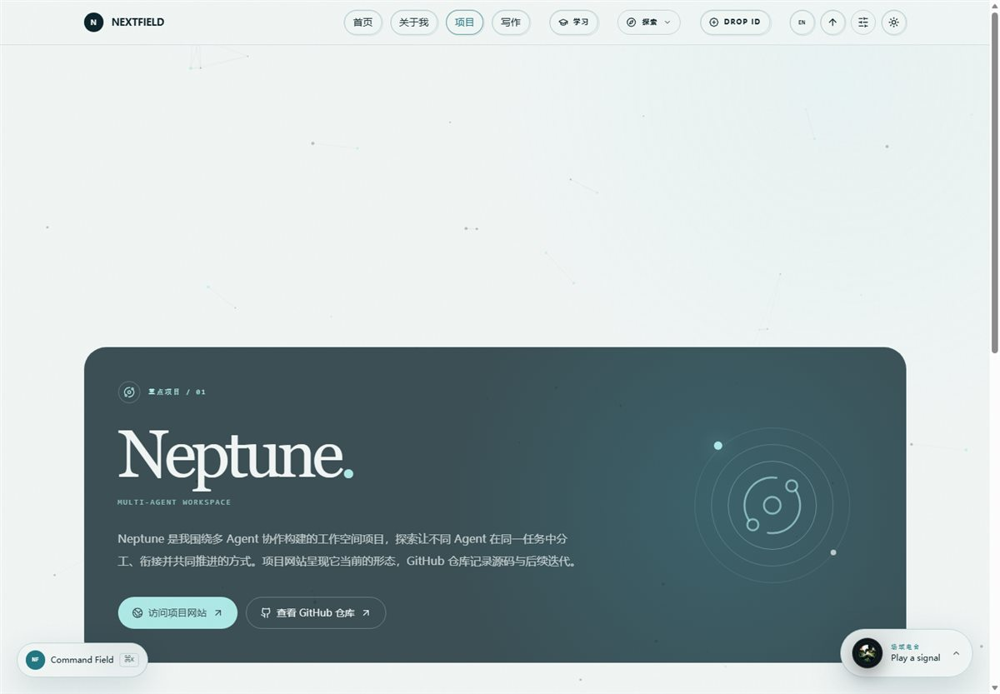
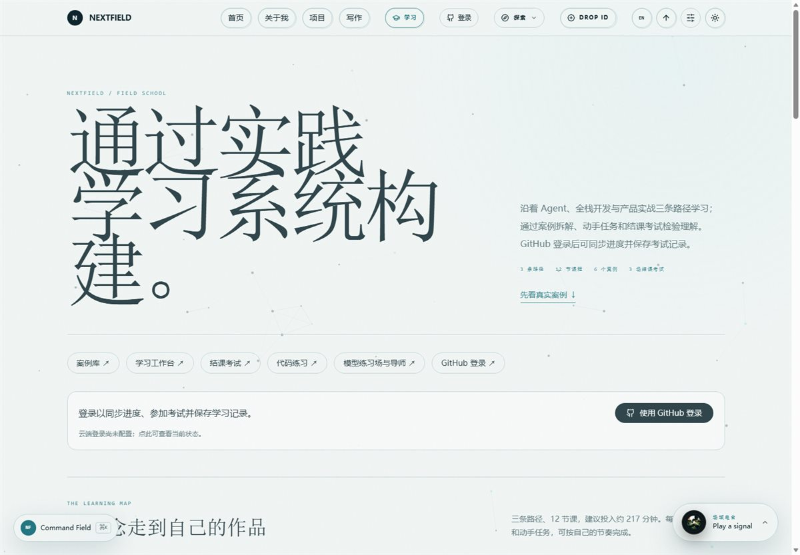
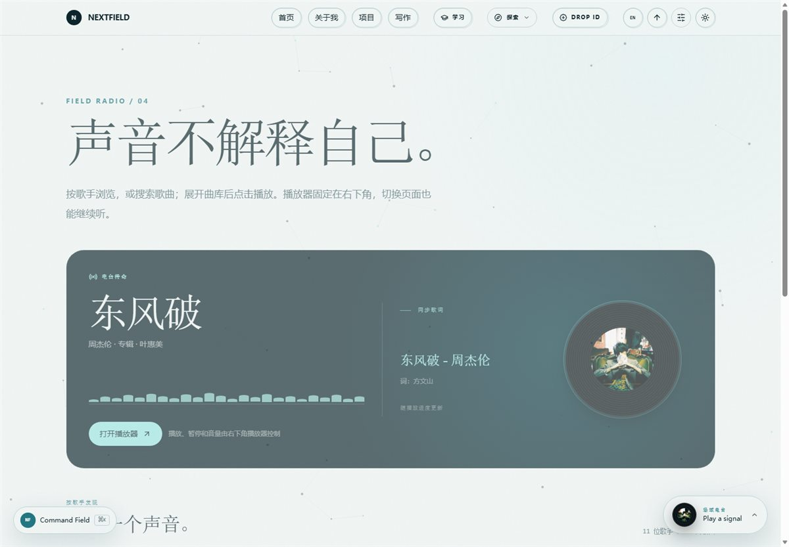
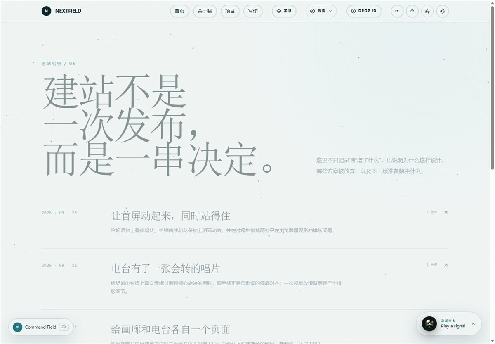

# NEXTFIELD / 下一场域 · V2.0.0

一个持续生长的个人网站，收录项目、写作、视觉实验与学习内容。项目页以 [Neptune 多 Agent 工作空间](https://github.com/Cattleyaaaaa/Neptune-Multi-agent-Workspace)为重点作品，提供[项目网站](http://myneptune.tech/)和源码入口；其他项目方向仍在整理中。

站内还有开放实验室、按文件夹生成相册的画廊、Field Radio，以及 FIELD SCHOOL：3 条学习路径、32 节双语课程、四阶段课程目录、案例库、代码练习、免登录综合自测和正式结课考试。Agent 路径从概念与 LLM 开始，逐步进入工具、状态、RAG、多 Agent 与生产实践；全栈路径从 Web 原理、HTML、CSS、JavaScript 开始，进入 React、接口、数据库、GitHub 登录、测试和交付。课程可直接阅读；GitHub 登录、跨设备进度、账户记录及正式考试依赖 Supabase。课程导师另需模型接口配置。

FIELD SCHOOL 提供从入门到交付的课程路径。功能与验收清单见 [V1.1.0 说明](docs/v1.1.0-review.md)，版本更新见 [发布说明](docs/releases/V1.1.0.md)。正式考试每条路径 6 题，答对至少 5 题通过；开放自测每节课一道题，仅供复习，不上传成绩或生成正式记录。实践任务为学习者自查，不提供自动代码评分。

## V2.0.0 更新

- **Field Agent**：免登录、仅回答本站内容的 DeepSeek 流式助手，附真实来源；每位访客按 IP 每日 5 次，全站每日 100 次。
- **内容发现**：7×7 全息光柱矩阵，局部悬停反馈、五类内容信号与问题种子；浏览卡片不消耗提问额度。
- **导航重构**：首页、关于、项目、写作、留言、统计集中排列，贴近助手入口；恢复按钮高光反馈，附加工具进入设置。
- **双语内容**：新增十三篇文章、三篇随笔，同步建站纪事和制作说明，写作日期覆盖 10 月 1 日至 8 日。

- **日期整理**：随笔自动按日期倒序；失败博物馆展示收录日期，保持最新记录在前。

[在线体验](https://nextfield.top/) · [V2.0.0 发布说明](docs/releases/V2.0.0.md) · [完整更新记录](CHANGELOG.md)

## Field Agent（V2.0.0，已上线）

免登录的站内探索助手，使用服务端 DeepSeek API，回答项目、文章、建站纪事、制作说明、随笔、网站概览和作者介绍。顶部导航与左下角按钮可直接打开；桌面采用右侧科技控制台，手机全屏。回答逐段生成，正文隐藏引用编号，来源以可点击标题卡片呈现；介绍类回答会根据资料展开，资料不足时说明缺失。

开场采用 7×7 全息信号矩阵：待机光柱静止，仅鼠标指向的光柱及紧邻区域抬升、变亮。五种主题颜色对应十条真实站内内容，点击展开内容信号和问题种子，支持打开原文、换一条、预填问题。发现内容不调用模型、不扣额度；预填的问题由访客确认发送。手机可点光柱或主题按钮，键盘支持方向键和 Enter，关闭动效时仍能使用。生成回答时显示缩小的波动矩阵。

- 每 IP 每日 5 次、全站每日 100 次，至少间隔 5 秒，北京时间 00:00 重置；失败请求也计数，共用网络可能共用额度。
- 问题、最近三轮对话及相关站内资料发送至 DeepSeek。对话只保留在当前页面会话，刷新后清空。
- 生产使用 Cloudflare Durable Object 持久化额度；本地开发使用进程内计数。
- 知识索引来自公开页面、Git 跟踪的非草稿与非示例文章，以及 `content/field-agent-posts.json` 明确收录的十三篇双语新文章；其他本地文件不自动进入索引，课程暂只提供入口说明。

在 `.env.local` 中配置 `DEEPSEEK_API_KEY`、`DEEPSEEK_MODEL`，在本地进程启用 `FIELD_AGENT_ENABLED=true` 后运行开发服务即可体验。V2.0.0 已通过类型检查、Cloudflare 生产构建和 Worker 打包预演，生成 160 份问答资料及 10 条内容信号，并已部署到正式域名；生产开关为 `true`。功能、数据去向与预览步骤见 [Field Agent 说明](docs/field-agent-plan.md)，部署记录与后续发布步骤见 [V2.0.0 发布说明](docs/releases/V2.0.0.md)。

## Analytics（V1.2.0）

网站提供 `/analytics` 公开统计看板，并在顶栏与探索导航中提供入口。包含 7/14/30/365 天筛选、请求数、周期独立访问、页面浏览、缓存命中率、传输带宽、小时与每日趋势、数据表和 JSON 导出。使用 Cloudflare Zone GraphQL 汇总数据，令牌仅存放服务端；不新增访客追踪脚本。未配置或查询失败会明确展示状态，不伪造实际流量；主动选择示例模式可审核布局和交互。

配置和指标口径见 [Analytics 说明](docs/analytics-deployment.md)。真实数据需要在部署环境配置具备 Zone Analytics 读取权限的 Cloudflare API Token；本仓库不包含令牌。

版本更新记录见 [CHANGELOG.md](CHANGELOG.md)。

## 导航与十月内容

顶栏保持单行：桌面直接展示首页、关于、项目、写作、留言、统计与 Field Agent，导航使用鼠标跟随高光按钮。手机保留首页、留言、统计、助手和探索图标入口；关于、项目、写作也可从探索菜单进入。语言、特效、工牌和账户操作放入设置，较窄屏幕的主题切换也放入设置。按钮效果遵循站内动效开关与系统减少动态效果偏好。

十月写作覆盖 Agent、前端、交互、设计、工程、技术、产品和哲学。新增十三篇文章均有英文正文，并通过明确清单收录到 Field Agent；随笔补充写作、未完成的时间与一天收尾等日常观察。日期覆盖 2026-10-01 至 2026-10-08。

## 页面预览

下方是网站的实际页面截图。点击图片可以查看大图。

| 项目展示 | 学习系统 |
| :---: | :---: |
| [](docs/images/projects.jpg) | [](docs/images/learn.jpg) |

| 音乐电台 | 建站纪事 |
| :---: | :---: |
| [](docs/images/gallery-radio.jpg) | [](docs/images/build-log.jpg) |

## 本地运行

当前项目使用 Next.js 15.5.26、React 19.2.8、TypeScript、Tailwind CSS、GSAP、Framer Motion 和 OGL。本次发布构建使用 Node.js 24.18.0；具体依赖及运行时要求以 `package.json`、锁文件和 Cloudflare 工具链为准。

```bash
npm ci
npm run dev -- -p 3334
```

打开 <http://localhost:3334>。基础页面无需环境变量；若要测试 GitHub 登录、账户进度和模型功能，先参考 [.env.example](.env.example) 配置本地 `.env.local`。不要把密钥写进源码或提交到仓库。

音源 `public/audio/` 不在 Git 仓库中；完整电台发布需要工作区已有对应音频。问答索引和内容信号会在开发或构建前自动生成。

常用检查：

```bash
npm run typecheck
npm run lint
npm run build
node scripts/test-learning-content.cjs
node scripts/test-school.cjs
node scripts/test-school-auth.cjs
node scripts/test-school-exam.cjs
```

## 内容放在哪里

| 内容 | 编辑位置 |
| --- | --- |
| 站点名称、描述、正式域名及 GitHub 联系方式 | `site.config.ts` |
| 建站纪事、制作说明、随笔（中英文） | `lib/editorial-data.ts` |
| 工作台状态、失败记录与能力地图 | `lib/nextfield-data.ts` |
| Field Agent 知识索引生成 | `scripts/build-field-agent-index.mjs`、`lib/field-agent-retrieval.ts` |
| Field Agent 新文章收录与内容信号 | `content/field-agent-posts.json`、`lib/field-agent-signals.ts`、`components/site/field-agent-discovery.tsx` |
| Field Agent 面板、流式接口与限流 | `components/site/field-agent*`、`app/api/field-agent/`、`workers/field-agent-limiter.mjs` |
| 项目页的 Neptune 重点介绍与其他方向 | `components/projects/` |
| 写作文章 | `content/posts/*.mdx` |
| 画廊相册 | `public/gallery/<相册名>/`；规则见 [画廊说明](public/gallery/README.md) |
| 电台曲目、音频、封面与同步歌词 | `lib/radio-data.ts`、`public/audio/`、`public/covers/`、`public/lyrics/` |
| 学习课程、案例与考试 | `lib/learn-data.ts`、`lib/learn-guides.ts`、`lib/learning-resources.ts`、`lib/school-exam-data.ts` |
| 学习数据库结构 | `supabase/migrations/` |

## 部署

此站点包含服务端 API、GitHub 登录回调和考试判分，**不能使用纯静态导出，也不能直接上传 `out/` 到 Cloudflare Pages**。先在本地运行上面的检查，并确认准备发布的代码和 `public/` 资源都已进入网站仓库。当前正式域名为 `https://nextfield.top`，与 `site.config.ts` 和 `wrangler.jsonc` 保持一致。

### 环境变量与登录

按 [.env.example](.env.example) 配置部署环境；本地密钥写入被 Git 忽略的 `.env.local`。以下变量在 Vercel 或 Cloudflare 的生产环境中都需要按功能设置：

| 变量 | 用途 | 公开性 |
| --- | --- | --- |
| `NEXT_PUBLIC_SUPABASE_URL`、`NEXT_PUBLIC_SUPABASE_ANON_KEY` | Supabase 项目和客户端登录 | 可公开；构建时也需可用 |
| `SUPABASE_SERVICE_ROLE_KEY` | 服务端考试、记录与额度操作 | 仅服务端 Secret |
| `SITE_URL` | 正式站点 origin，如 `https://你的域名` | 服务端配置；不要带路径或末尾斜杠 |
| `OPENAI_API_KEY`、`OPENAI_MODEL` | 可选课程导师 | API Key 仅服务端 Secret |
| `DEEPSEEK_API_KEY`、`DEEPSEEK_MODEL` | Field Agent 站内问答 | 密钥仅服务端使用；模型名可配置 |
| `FIELD_AGENT_ENABLED` | Field Agent 开关，默认 `false` | 免登录，每 IP 每日 5 次，全站每日 100 次 |
| `FIELD_AI_ENABLED` | 模型功能开关，默认 `false` | 启用前先设置费用与滥用防护 |

在 Supabase 依次应用 `supabase/migrations/` 中尚未执行的迁移，并完成 [FIELD SCHOOL 部署说明](docs/field-school-deployment.md)中的 GitHub OAuth 和权限配置。GitHub OAuth App 的 Authorization callback URL 填 Supabase 提供的 `https://<project-ref>.supabase.co/auth/v1/callback`；Supabase 的 Redirect URLs 则加入 `https://你的域名/auth/callback`。绑定域名后同时更新 `site.config.ts` 的 `url`、`SITE_URL` 和 Supabase Site URL，然后重新部署。不要把 `SUPABASE_SERVICE_ROLE_KEY` 或 `OPENAI_API_KEY` 加上 `NEXT_PUBLIC_` 前缀。

### Cloudflare Workers（当前部署方式）

项目已接入 OpenNext Cloudflare 适配器，使用 `wrangler.jsonc`、`open-next.config.ts` 和 `worker-entry.mjs`。普通开发输出为 `.next-development`，普通生产构建为 `.next-production`；Cloudflare 构建通过 `CLOUDFLARE_BUILD=1` 使用 `.next`，并生成 `.open-next` 产物。Worker 包装入口还处理本站 MP3 的 Range 请求，并导出 Field Agent 限流 Durable Object。

```bash
npm run cloudflare:build
npm run preview
```

`preview` 会重新构建并在 Workers 环境预览。运行时密钥写入 Cloudflare Secrets；本地 Workers 预览使用被忽略的 `.dev.vars`，格式见 [.dev.vars.example](.dev.vars.example)。涉及浏览器的 Supabase 公开变量也需要在构建环境配置。完整问答索引与轻量内容信号由脚本自动生成，不提交生成的 JSON。

Field Agent 已配置 DeepSeek Secret、`FIELD_AGENT_LIMITER` 绑定及 `field-agent-v1` SQLite Durable Object 迁移，生产 `FIELD_AGENT_ENABLED=true`。后续发布仍需保留这些配置；缺少额度绑定时问答拒绝服务。完整重新构建并发布的命令为 `npm run deploy`。详见 [V2.0.0 发布说明](docs/releases/V2.0.0.md)、[Field Agent 说明](docs/field-agent-plan.md)与 [FIELD SCHOOL 部署说明](docs/field-school-deployment.md)。

### Vercel（当前 Next.js 构建可用）

把网站仓库导入 Vercel，选择 Next.js，构建命令保持 `npm run build`；不要设置静态导出。填入上述环境变量，先用预览地址检查公开页面，再配置正式域名与 Supabase/GitHub 回调。登录、考试及权限的逐项验收见 [FIELD SCHOOL 部署说明](docs/field-school-deployment.md)。

Field Agent 的共享额度当前依赖 Cloudflare Durable Object；其他宿主需提供等效共享限流后才能启用问答，不能使用开发进程计数替代生产限流。内容发现卡片不依赖模型接口。

无论使用哪家平台，正式开放前都要用两个不同账户验证登录、退出、进度隔离、考试资格与公开档案权限，并检查中英文、移动端、断网及音频播放。不要把本地构建成功当作线上功能已验收。

## 仓库与隐私

`.gitignore` 忽略本地环境变量、Cloudflare `.dev.vars`、私钥/证书、本地数据库、备份、测试报告和临时目录。忽略规则**不会移除已经提交过的文件，也不能撤销泄露的密钥**；若误提交了密钥，应立即在对应服务轮换并检查 Git 历史。可用 `git status --short --untracked-files=all` 检查待提交内容。
